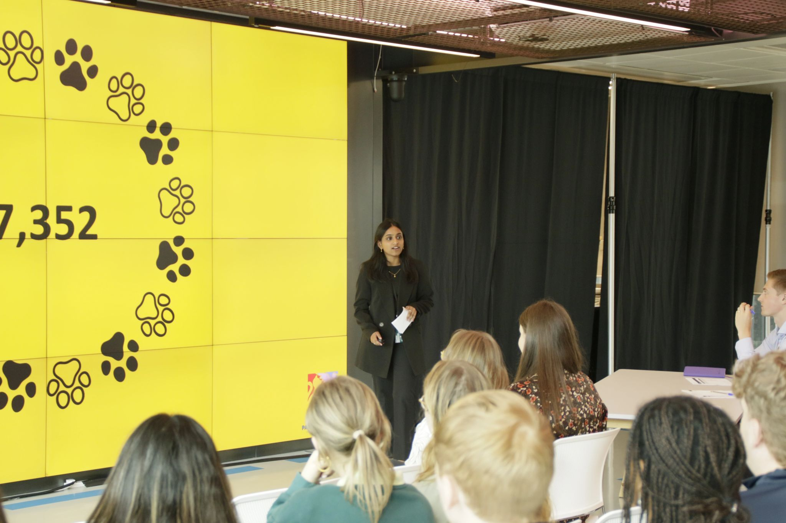

## Hi, Welcome to my Website👋  

I’m a final-year International Business student specializing in Data Analytics where strategy, technology, and insight come together. I’m glad you’re here. This website is a window into my work, ideas, and journey designed to give you a clear sense of who I am and what I do.

Whether you're here to explore my portfolio, learn more about my background, or dive into my latest blog insights, you'll find everything you need right here. Let’s connect and create something meaningful.

[Learn more about me!](about.html)

## Highlights

Newest Blog Post: [Read about my University Journey.](talk/undergrad/)

Undergraduate of the Year 2025: [Learn what Authentic Leadership means to me.](work/undergrad/)

Portfolio Update: [View my Animal Welfare Project](work/paws4justice/)

  <iframe width="800" height="700" 
    src="https://www.youtube.com/embed/l-2hOKIrIyI" 
    frameborder="0" allowfullscreen>
  </iframe>

Listen to My Favourite Study Playlist.

## Get in Touch  

  <a style="margin-right: 10px" href="https://linkedin.com/in/sadhana-r-sambandam" class="about-link" rel="" target="" data-original-href="https://linkedin.com/in/sadhana-r-sambandam">
    <i class="bi bi-linkedin"></i>
     LinkedIn
  </a>
  <a href="https://github.com/SadhanaR7" class="about-link" rel="" target="" data-original-href="https://github.com/SadhanaR7">
    <i class="bi bi-github"></i>
     Github
  </a>
  <a href="/Sadhana R Sambandam CV.pdf" class="about-link">Download My CV Here!
  </a>

<!--<</ul> -->

<!--<a href="https://github.com/yourprofile" target="_blank"><i class="fa fa-github" aria-hidden="true"></i></a>
<a href="https://linkedin.com/in/yourprofile" target="_blank"><i class="fa fa-linkedin" aria-hidden="true"></i></a>
<a href="https://instagram.com/yourprofile" target="_blank"><i class="fa fa-instagram" aria-hidden="true"></i></a>-->

<!--## Get in Touch
Connect with me on [GitHub](https://github.com/yourprofile), [LinkedIn](https://linkedin.com/in/yourprofile), and [Instagram](https://instagram.com/yourprofile). -->

<!--# Feature

---
# Contact

---
# Find me -->