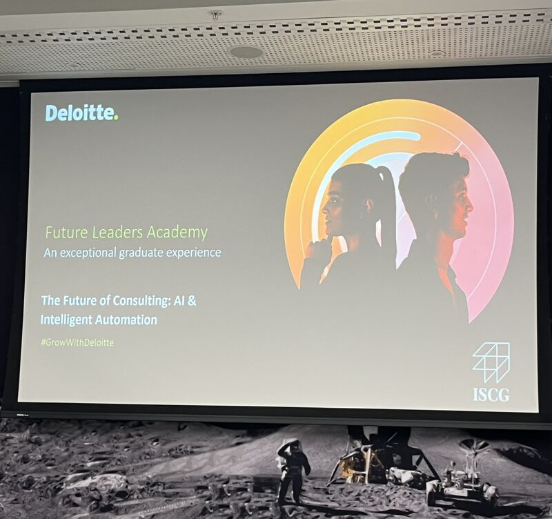

## RPA, Power Platforms and AI Automation in Consulting
I had the opportunity to attend the Irish Student Consulting Group (ISCG) and Deloitte Networking and Panel Discussion Event titled The Future of Consulting: AI and Intelligent Automation. The event brought together students, professionals, and industry leaders to explore how emerging technologies are reshaping the consulting landscape. It was an incredibly insightful experience that provided a comprehensive overview of the evolving role of artificial intelligence in business strategy and operational efficiency.

One of the key takeaways for me was the deep dive into Robotic Process Automation (RPA) and how these tools are streamlining workflows for both clients and employees. Connell Gray’s live demonstration of an RPA and Generative AI model stood out as a highlight, clearly illustrating the powerful capabilities of intelligent automation. The panel discussion that followed was equally compelling, offering perspectives from professionals currently navigating these changes in the field. The open dialogue and practical insights made the event not only informative but also inspiring.

Reflecting on the experience, I found myself more energized than ever about the direction of consulting in an AI-driven world. The event reinforced the importance of staying curious and adaptable in a landscape that is rapidly shifting. It also highlighted the value of collaboration between technology and human expertise. I left with a renewed sense of purpose and a desire to keep learning and contributing to this exciting field. A heartfelt thank you to Deloitte and ISCG for making this event possible and for creating a platform that bridges the gap between students and industry.