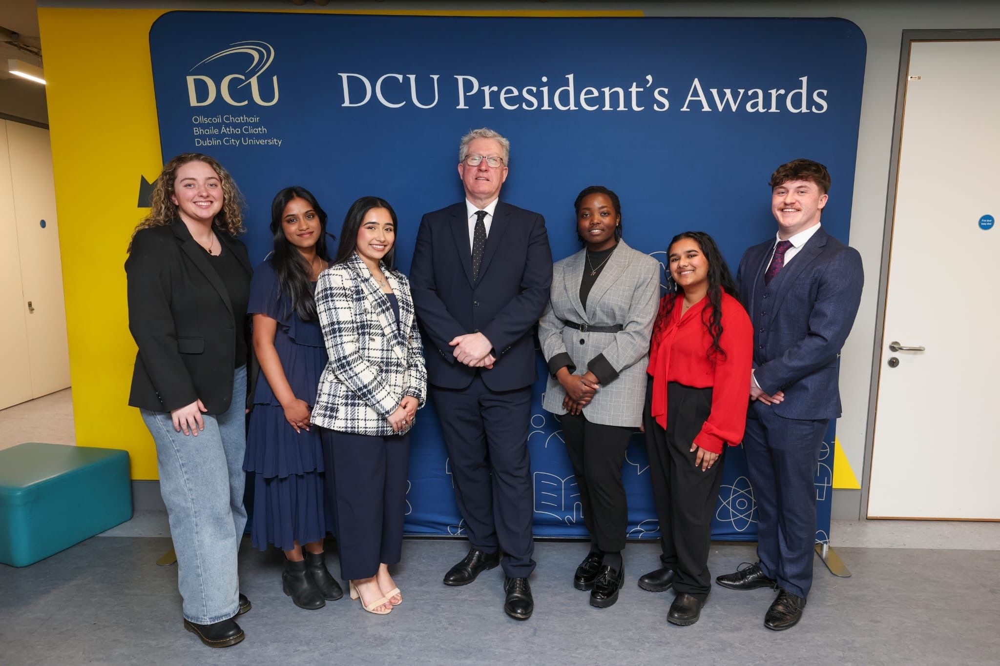

## Learning to Show Up: What Being Nominated Taught Me

A few weeks ago, I found out I was nominated for the DCU President’s Award for Engagement. I smiled when I read the email, then sat back and stared at my screen for a while. Not because I was waiting for more, but because I needed a moment to take it in.

For the past few years, I’ve poured myself into things that mattered to me. I didn’t do them with recognition in mind, I did them because I cared. I cared about making students feel seen. I cared about building connections and making others’ paths a little easier than mine had been. I cared about showing up, even when I didn’t quite know how to do it perfectly.

And in all of that, I never stopped to ask what it was adding up to. But this nomination reminded me that effort, done consistently and with heart, does create something meaningful.

## Finding My Voice
When I stepped into my first leadership role, I didn’t know what I was doing. But I knew what I wanted to be. I wanted to be approachable. I wanted to be useful. I wanted to be the kind of person who made things feel less overwhelming for others, because I remembered how that felt.

And slowly, I started finding my voice. Not the kind that takes over a room, but the kind that sends follow-up emails, checks in on people, and makes space for stories that would otherwise go unheard. I found a rhythm in the quiet actions—the unseen work, the late-night planning, the thought put into making someone feel a little more supported.

Somewhere in all of that, I stopped trying to lead the “right” way and started leaning into my own way of doing things. That’s when everything began to feel real.

## What This Nomination Taught Me
More than anything, it taught me that being present matters. It affirmed something I had always believed deep down but didn’t always say out loud: that you don’t have to be extraordinary to make a difference. You just have to keep showing up with care and consistency.

It also reminded me that impact is often invisible in the moment. You don’t always get feedback. You don’t always see the ripple. But sometimes, weeks or months later, someone tells you that something you said or did made a difference. And in that moment, it all feels worth it.

The nomination didn’t validate what I did. It validated why I did it.

## Looking Ahead
I’m not walking away from this experience with a checklist of new goals or a next big thing. I’m walking away with a mindset.

I want to keep doing work that feels honest. I want to be in spaces where people are encouraged to lead in ways that feel authentic to them, not just what’s expected. I want to continue helping others feel like they belong, especially when they’re just starting out or feeling lost.

And most of all, I want to hold onto the idea that care is powerful. That thoughtfulness is leadership. That you don’t have to wait for a title, a role, or recognition to start making a difference. You just have to start where you are, with what you have.

To anyone reading this who’s wondering if it’s worth it: it is. Don’t underestimate the impact of being someone who chooses to care.

