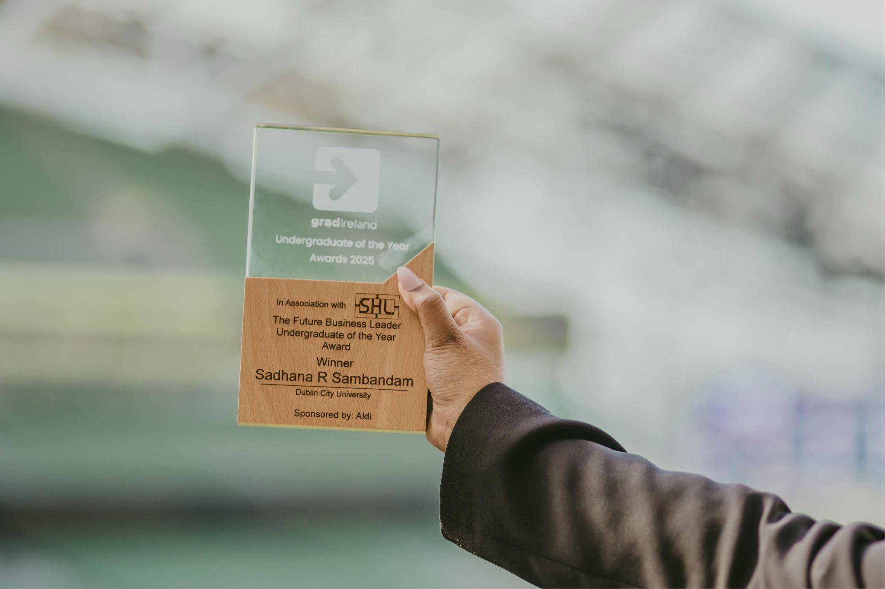
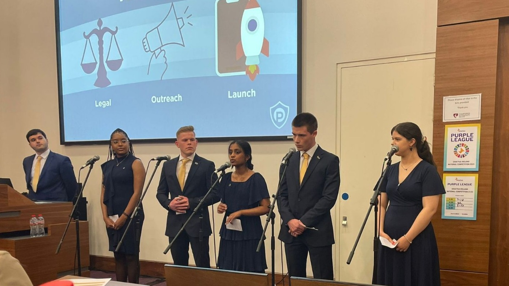
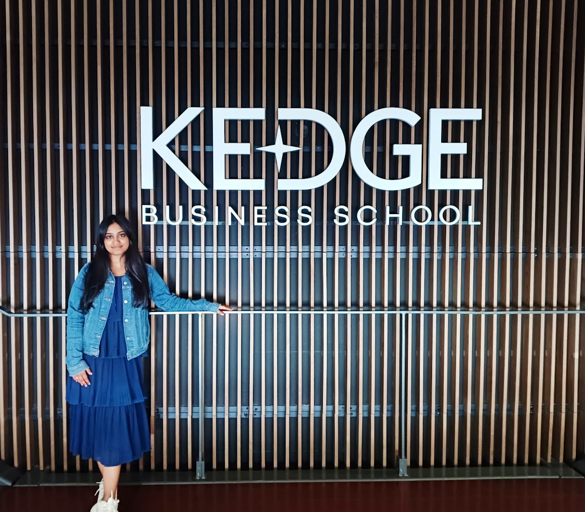
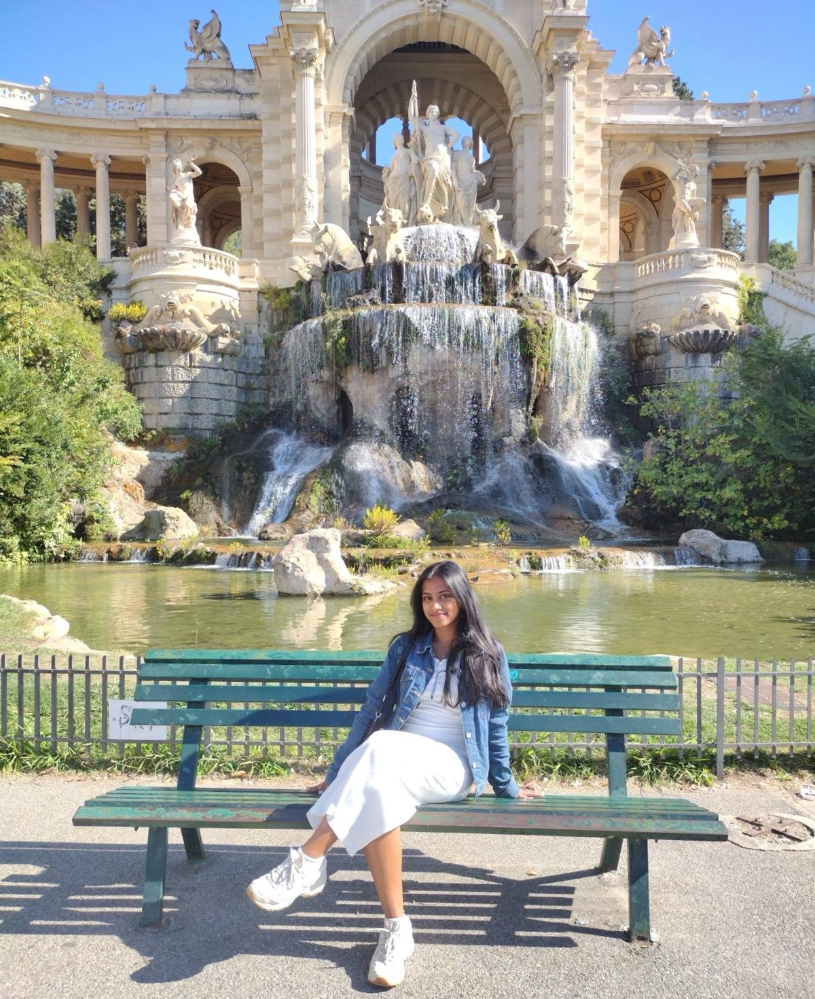
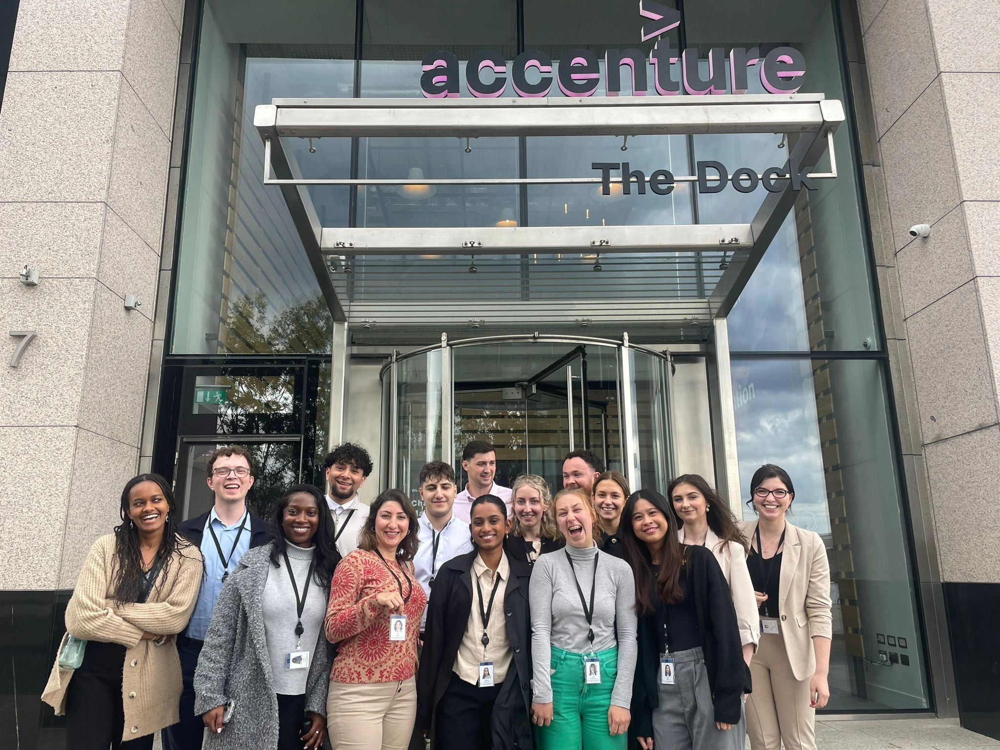
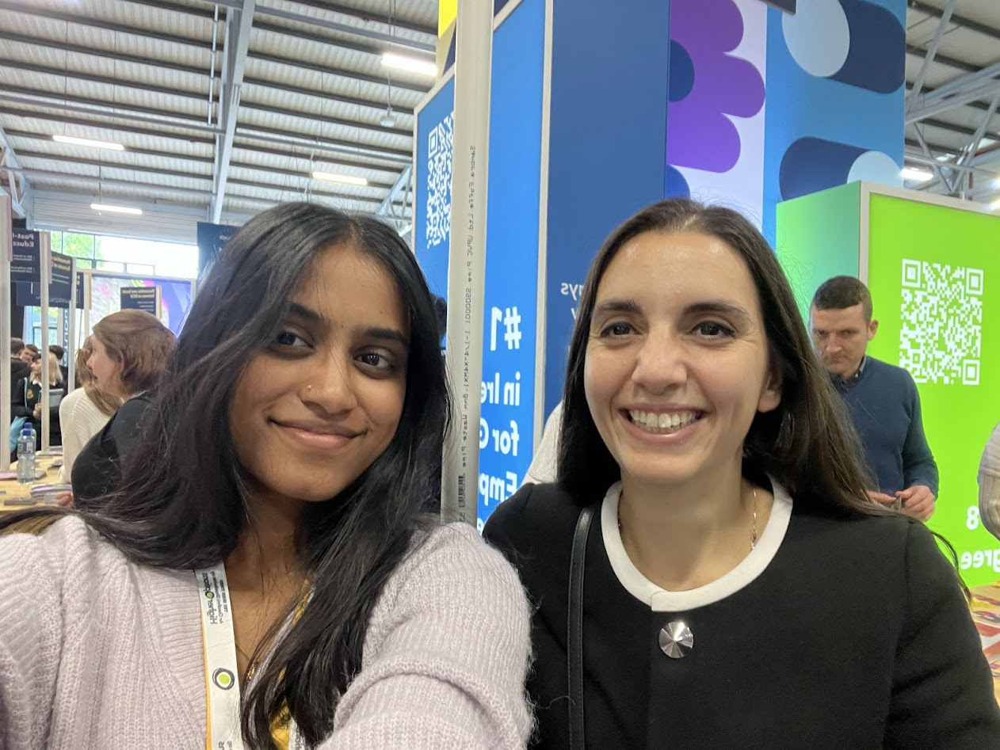
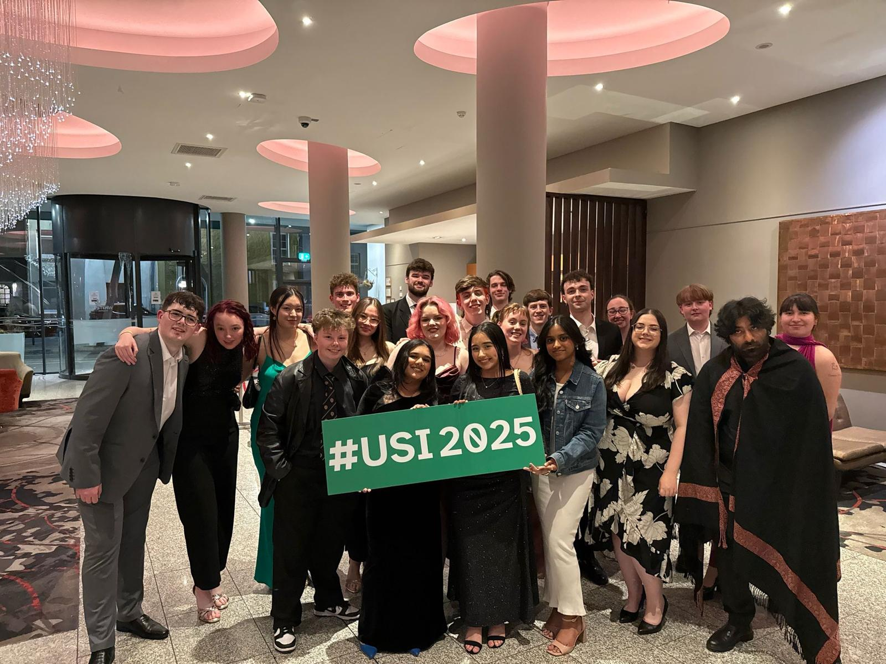
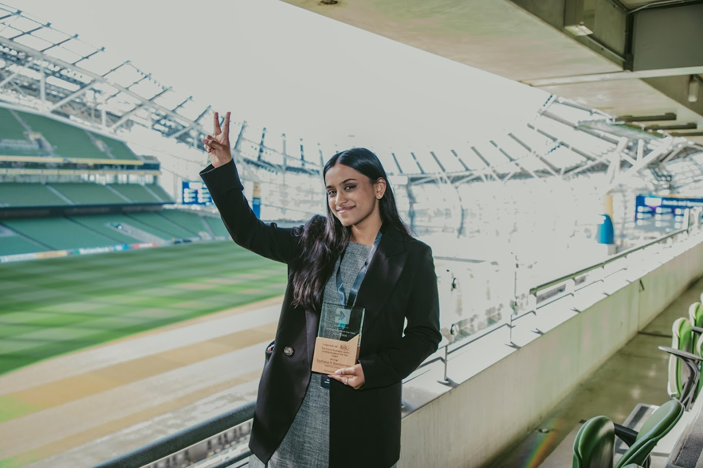

## From Reluctant Teen to Future Business Leader: My Unexpected Journey

When I first stepped into a Business Studies class in secondary school, I didn’t have a clue what I was getting into. My dad suggested I take the subject, and I did, not entirely sure why it was relevant when I had subjects like maths and science in the mix. I remember my teacher, Miss Hynes, asking the class, “What do you care about?” as soon as we walked in to the prefab room.  And while I answered with the obvious, my family, my friends, it felt like no response was quite right. Then she said, “You’re business people. You care about money.”

And something shifted in me.

It wasn’t about money in the literal sense. It was about impact, innovation, and influence. Frankly, it made me realize that the whole point most of us do anything including study was for the hope that it would make us money. Now this nonsense class suddenly got very interesting and neccessary. I continued with Business Studies, added Accounting, and slowly, my future started to form in my mind. Ms. Hynes, someone I’ll never stop being grateful for, planted the seed that would grow into the career I’m now beginning to cultivate.

## The College Choice That Didn't Go as Planned

Fast forward to Leaving Cert results. I scored 543 out of 625 points. I was proud of that, especially given the chaos COVID-19 brought to our education. But I didn’t get my first choice or my second. I got my sixth. International Business at DCU.

And I’ll be honest. It stung. I had poured everything into my studies, and I felt like the outcome didn’t match the effort. But sometimes, life gives you what you need instead of what you want. Ms. Hynes had actually recommended DCU to me. Somehow, it was always meant to be. And though it was not what I imagined, it became everything I needed. I reimaged the DCU open day and remember the feeling, as if it was god's plan all along.

## First Year

Like many others, I walked into college expecting something like the movie Three Idiots. I thought I would find lifelong friends, discover new passions, and live out a romanticized version of student life. But the reality was different. I commuted three hours to and from university daily, moving between home and campus, trying to keep pace with academic life and the unfamiliar university culture. I am from a small town and so I needed to learn things like how to use a leap card on a bus. Everything seemed too scary, the world too big. The days were long, the halls were quiet, and I often felt like a spectator rather than a participant.

Some classes intrigued me, others left me questioning my place. French, though fascinating in terms of culture and history, was especially difficult. I didn’t join any societies or clubs. I barely knew anyone, went to class and came home not understanding why everyone told me "these are the best days of your life". And I didn’t know where I fit in. Still, there was one unwavering certainty, I loved what I was studying and that, more than anything, kept me going.

Then on the very last day of first year, things changed. I met a group of girls who would become my closest friends. We bonded over our shared confusion, our ambitions, and our desire to find meaning in the university experience. It made me realise that perhaps not everyone meets their best friends during orientation week. That connection reminded me that feeling alone is often just the first step toward finding your people.

## Second Year

This was the most impactful year for me. I truly came out of my shell and threw myself into university life. I joined what felt like too many clubs and societies and balanced academic rigor with an expanding portfolio of extracurricular commitments. I became our Class Representative in the Student Union, which gave me a seat at the table where student voices were heard and acted upon. One of the most important achievements during this time was successfully advocating for the introduction of the Data Analytics Specialism. Thanks to this effort, students in DCU's Business School can now choose Data Analytics as their focus area, just as easily as they would Finance, HR, or Economics. Knowing I helped create that legacy for future students still fills me with pride.

In addition to student representation, I became Secretary of the Speakeasy Society. In this role, I helped members develop confidence and public speaking skills while also co-organizing trips to L’Oreal and attending TEDx events that broadened our view of business and innovation. I joined Enactus and worked on the student-led social enterprise startup Parking Protect, an initiative to report parking abuse using AI. Within one month of launching, the app impacted 270,000 individuals. We became finalists in the .IE Digital Town Awards and participated in the Enactus Ireland National Competition. Our project was also selected for Citi Bank’s Pathways to Progress program.

It was in this whirlwind of leadership, entrepreneurship, and learning that I created my LinkedIn profile and started to curate a professional brand. For the first time, I began to feel like I was not just studying business, I was living it.

## Third Year

Then came my third year abroad at KEDGE Business School in Bordeaux. This year changed everything. I discovered myself on a personal level. I was always a girl with a plan, a type A personality and a colour coded spreadsheet. This year taught me to let loose and live a little.

I learned how to navigate a foreign country, a different academic system, and a language that had previously intimidated me. I embraced independence fully, learning to cook, clean and care for myself completely, budget,  plan my travels, and manage my time between adventure and academics. I visited cities that had once only existed on my Pinterest board and formed friendships with people from all over the world. I was not just studying international business, I was living it on a global stage. 

I said "Yes" to everything that previously I was too shy to do. The girl that had no clue how to use a leap card or get a LUAS to town now getting on a train to a solo trip across the South of France, seemed unimaginable but transformative

Academically, I found the curriculum in Bordeaux both demanding and rewarding. I was exposed to new perspectives on strategy, marketing, and entrepreneurship, and it helped reinforce my interest in using data and analytics for innovation. Oh and learning every subject in French was just the cherry on top to the challenge. 

While in France, struggling with the long days, I applied for and landed a highly competitive summer internship with Accenture in their Data and AI division as an Analyst Intern. Then I quickly packed up my apartment, unable to get my deposit back from the greedy land lady and said goodbye to the many friends I made. I still miss them dearly and speak to them everyday. I felt like the main character of my own story for the first time in France. Starting the position and feeling like an imposter, I participated in the Accenture Leaders of Tomorrow Program. I led my intern team and won first place, presenting AI-powered solutions to improve efficiency in the utility sector. It was a defining moment, proof that I belonged in rooms where solutions were shaped and decisions were made. I must say it did help boost my confidence.

## Final Year

The transition into final year was marked by a mixture of excitement and purpose. While the election for Business Faculty Representative had taken place in third year during a brief return to DCU over Christmas, I only officially took on the role in my final year. I had campaigned in February, traveling from Bordeaux back to Ireland, and won the election with majority votes. That brief return, filled with posters, speeches, and shaking hands, was one of the most invigorating weeks of my college journey. I flew back to France just after the victory to complete my second semester abroad, but I returned to DCU in September ready to take on the responsibility.

As the Business Faculty Representative, I had the opportunity to represent 5000 students and elevate their voices to faculty leadership. I organized meaningful events like the Intra and Erasmus Networking Sessions and worked to ensure that students, especially those on international or placement years, felt connected and informed.

Academically, I dove deep into the Data Analytics specialism I had once advocated for. I learned Python from scratch, explored machine learning, and built a personal website to showcase my projects (which is where you are reading this!) . I discovered a real love for data storytelling, turning raw information into something understandable and impactful.

Professionally, the pace never slowed. A startup founder reached out to me via LinkedIn, impressed by the work I had already done. I joined [KatoAI](https://kato-ai.com/), a global edtech startup focused on AI-powered language learning tools, and contributed to marketing and business development. It was a crash course in agility, collaboration, and creativity.

Then came the return offer from Accenture for a full-time graduate role. I accepted it with pride. It felt like all the late nights, uncertainties, and leaps of faith had finally led to something remarkable.

Oh, and I won the Undergraduate of the Year Award for Future Business Leader.

## Lessons from the Climb

This journey was not linear. It was filled with doubt, detours, and late night study marathons. I didn’t always feel confident. I didn’t always feel seen. But every step, every quiet bus ride, every awkward club meeting, every tough exam built me into someone who leads with empathy, purpose, and persistence.

Warren Buffett once said, “The best investment you can make is in yourself.” I didn’t understand what that meant back in Ms. Hynes’ classroom, but I do now. College is not just about lectures or grades. It is about building yourself, piece by piece.

To anyone starting college feeling scared, overwhelmed, or unsure, you are not alone. And to those ending college wondering what comes next, just know that even if your path is not perfectly paved, you have everything it takes to build something extraordinary.

Because the truth is, leaders are not born. They are built in classrooms, on long commutes, through quiet courage and unexpected friendships.

And sometimes, it all starts with a single question. What do you care about?
