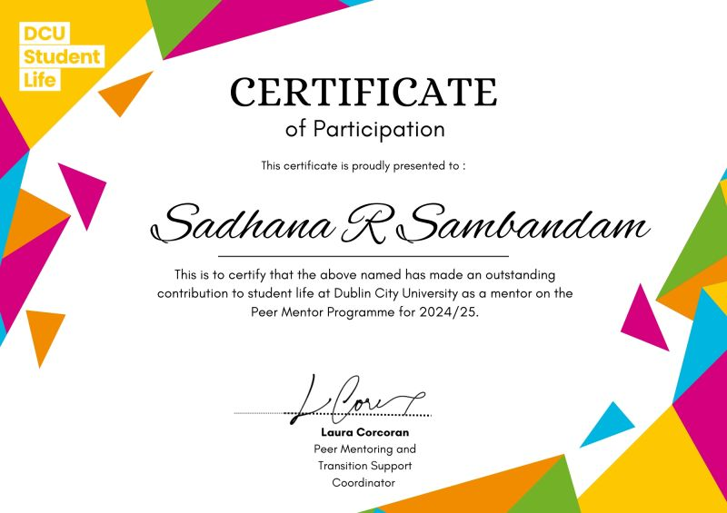

Feeling grateful as I wrap up an enriching journey as a Peer Mentor at DCU!

As a final year student, it’s been incredibly rewarding to support and guide first-year students through their transition into university life. Whether it was sharing academic tips, offering reassurance, or simply being there to listen, every interaction reminded me of how powerful peer support can be.

Thank you to DCU Student Life and Laura Corcoran for the opportunity and for recognising my contribution. The Peer Mentor Programme for 2024/25 has not only allowed me to give back to the student community, but also helped me grow in empathy, leadership, and communication.

Wishing all the students I had the pleasure of mentoring the very best in their journey ahead! This was my second year as a peer mentor and I really do recommend students to get involved with the vibrant community. 

A special shoutout to the amazing mentees who still reach out even after the sessions ended, including those from last year. Your messages and updates truly mean the world and remind me why I signed up for this in the first place.
