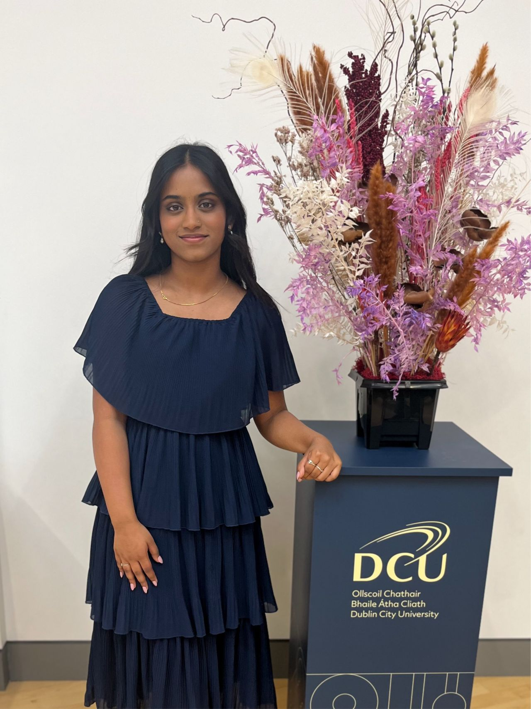

## Honoured to Be Nominated: A Reflection on Engagement, Growth, and Purpose

This year, I was humbled to be nominated for the DCU President’s Award for Engagement, an experience that has prompted me to pause, reflect, and appreciate the journey so far.

Student engagement, to me, has never been about ticking boxes or adding lines to a CV. It’s been about building bridges between students and faculty, between different year groups, and between where we are now and where we hope to go. It’s about stepping up not because you have to, but because you care.

My journey at DCU has been one of discovering how much impact a single voice can have when it’s backed by intent, empathy, and follow-through.

## Leading with Purpose
As a Class Representative and now as the Business Faculty Representative, I’ve had the privilege of serving over 5,000 students. These roles have taught me the importance of active listening, collaborative problem-solving, and making space for diverse voices. Whether it was advocating for a new Business Analytics specialism or facilitating Student-Staff Forums, I’ve aimed to ensure that student feedback is heard, understood, and acted upon.

Some of the most fulfilling moments came from conversation those quiet, one-on-one chats where a student felt seen or supported. Representation isn’t always loud; sometimes it’s the consistent showing up, the emails sent, the questions asked on someone else’s behalf, or the push for initiatives that may not benefit me directly, but serve the wider student community.

## Mentorship and Connection
Over the past few years, I’ve mentored around 25 students, many of whom are currently abroad. Staying connected to DCU while navigating a different country, culture, and academic system isn’t always easy—and I know this firsthand. Through regular check-ins, resource sharing, and emotional support, I’ve tried to help my mentees feel less alone and more empowered during their Intra and Erasmus journeys.

Organising the Intra and Erasmus Talks was a natural extension of this goal bringing together final-year students with second-years to share real, practical insights about placements and study abroad experiences. Events like these create continuity across cohorts and turn uncertainty into shared learning.

## Engagement through Action
Beyond representation and mentorship, my engagement also extended to supporting students’ career and academic progression. I’ve worked to organise employer events, highlight scholarship and funding opportunities, and share resources that help students access what they need to succeed. I believe that opportunities shouldn’t be hard to find—they should be shared loudly, clearly, and with the belief that every student deserves access.

I’ve also had the chance to be part of entrepreneurial projects within DCU, working with others to solve real-world problems and build tools that can create positive change. These experiences reminded me that innovation doesn't have to be grand or flashy, sometimes it's about finding simple, thoughtful ways to make someone’s life a little easier, or their education a little more accessible.

## What This Nomination Meant
Being nominated for the President’s Award wasn’t something I expected, but it was something that moved me deeply. It’s easy to keep going and doing without stopping to acknowledge what you’ve built. This nomination made me do just that.

More than anything, it reminded me that impact is noticed. That showing up consistently, even when it feels like no one sees it, matters. That creating change, whether big or small, starts from a place of care.

It also reminded me of the power of community. I’ve never done this work alone and I wouldn’t want to. From fellow reps and mentors to staff members and the students who trusted me with their stories, I’m grateful to everyone who’s been part of this journey.

## Looking Ahead
I don’t know exactly what’s next, but I know I’ll carry these lessons with me:
Lead with empathy.
Engage with purpose.
Don’t wait for permission to start something meaningful.
And always, always lift others as you rise.

I’m excited to continue contributing in whatever spaces I find myself—whether through advocacy, mentorship, innovation, or simply by showing up and helping others feel that they belong To anyone who’s just starting to get involved: do it. You don’t need a title or a formal role to make a difference. Just a willingness to care and to act on it.

Thank you again to everyone who’s supported me along the way. And thank you, DCU, for providing a space where engagement is not only encouraged, but celebrated.

```{=html}
<iframe width="600" height="500" src="My Civic and Public Engagement Journey.pdf"></iframe>
```